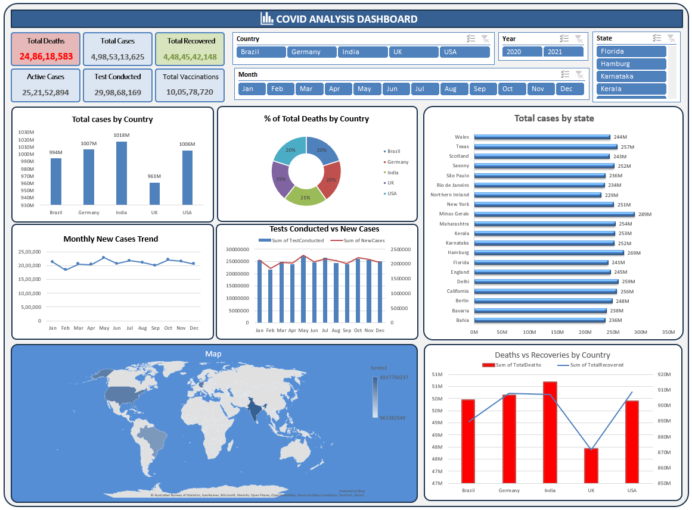

# COVID-19 Data Analysis Dashboard



## 📊 Project Overview

This project presents an interactive **COVID-19 Data Analysis Dashboard** for exploring COVID-19 cases, deaths, recoveries, testing, vaccinations, geographic distribution, and monthly trends.

The dashboard demonstrates an end-to-end **data analysis and dashboarding workflow** using:

- Data cleaning and preparation
- Pivot-table based analysis
- KPI development
- Trend analysis
- Country and state/region comparison
- Geographic visualization
- Interactive filters and slicers

---

## 🎯 Objectives

1. Analyze total COVID-19 cases, deaths, recoveries, active cases, testing and vaccinations.
2. Compare COVID-19 cases across countries.
3. Analyze case distribution across states/regions.
4. Identify monthly trends in new cases.
5. Compare testing activity with new cases.
6. Compare deaths and recoveries across countries.
7. Visualize geographic distribution of cases.
8. Build an interactive dashboard for exploratory analysis.

---

## 🗂️ Dataset

The project uses COVID-19 epidemiological data containing geographic, temporal and COVID-related metrics.

### Main fields

| Field | Description |
|---|---|
| Country | Country associated with the record |
| State | State/region associated with the record |
| Date | Date of the observation |
| Month | Month used for trend analysis |
| Year | Year of the observation |
| Total Cases | Cumulative reported COVID-19 cases |
| New Cases | Newly reported cases |
| Total Deaths | Cumulative reported deaths |
| Total Recovered | Cumulative recovered cases |
| Active Cases | Active cases |
| Tests Conducted | COVID-19 tests |
| Total Vaccinations | Reported vaccinations |

> Exact column names may vary depending on the source dataset used.

---

## 📌 Dashboard KPIs

The current dashboard screenshot displays:

| KPI | Dashboard Value |
|---|---:|
| Total Deaths | **24,86,18,583** |
| Total Cases | **4,98,53,13,625** |
| Total Recovered | **4,48,45,42,148** |
| Active Cases | **25,21,52,894** |
| Tests Conducted | **29,98,68,169** |
| Total Vaccinations | **10,05,78,720** |

These are the aggregated values visible in the dashboard screenshot and should be interpreted according to the underlying dataset and filter context.

---

## 🌍 Country Analysis

The dashboard compares selected countries:

- Brazil
- Germany
- India
- UK
- USA

### Total Cases shown in the dashboard

| Country | Approx. Dashboard Value |
|---|---:|
| Brazil | 994M |
| Germany | 1007M |
| India | 1018M |
| UK | 961M |
| USA | 1006M |

These values are dashboard-level aggregations from the displayed dataset/filter context.

---

## 📍 State / Region Analysis

The dashboard compares cases across states and regions including:

- Wales
- Texas
- Scotland
- Saxony
- São Paulo
- Rio de Janeiro
- Northern Ireland
- New York
- Minas Gerais
- Maharashtra
- Kerala
- Karnataka
- Hamburg
- Florida
- England
- Delhi
- California
- Berlin
- Bavaria
- Bahia

The horizontal bar chart enables regional comparison within the selected dataset.

---

## 📈 Monthly New Cases Trend

The **Monthly New Cases Trend** tracks reported new cases from January through December.

It can be used to examine:

- Monthly increases and decreases
- Peaks in reported cases
- Periods of relatively stable activity
- Changes in the pattern of reported infections

---

## 🧪 Tests Conducted vs New Cases

A combination chart compares:

- Tests Conducted
- New Cases

This provides a way to examine testing activity alongside reported cases.

> Testing volume should not be interpreted as a direct measure of infection levels. Positivity rates, testing practices and reporting methodology would be required for deeper epidemiological analysis.

---

## ⚰️ Deaths vs Recoveries

The dashboard compares cumulative deaths and recoveries across:

- Brazil
- Germany
- India
- UK
- USA

This visualization provides a country-level comparison of the two measures.

---

## 🗺️ Geographic Analysis

A world map visualizes the geographic distribution of COVID-19 cases.

This allows geographic patterns to be examined alongside the country and state/region charts.

---

## 🎛️ Interactive Filters

The dashboard contains slicers for:

### Country
Brazil, Germany, India, UK and USA.

### Year
2020 and 2021 are visible in the dashboard.

### State
Allows filtering by individual states/regions.

### Month
January through December.

The dashboard visuals update according to the selected filters.

---

## 🔄 Analysis Workflow

```text
COVID-19 Dataset
       ↓
Data Cleaning
       ↓
Data Transformation
       ↓
Data Validation
       ↓
Pivot Tables / Aggregation
       ↓
Dashboard Development
       ↓
Interactive Visualizations
